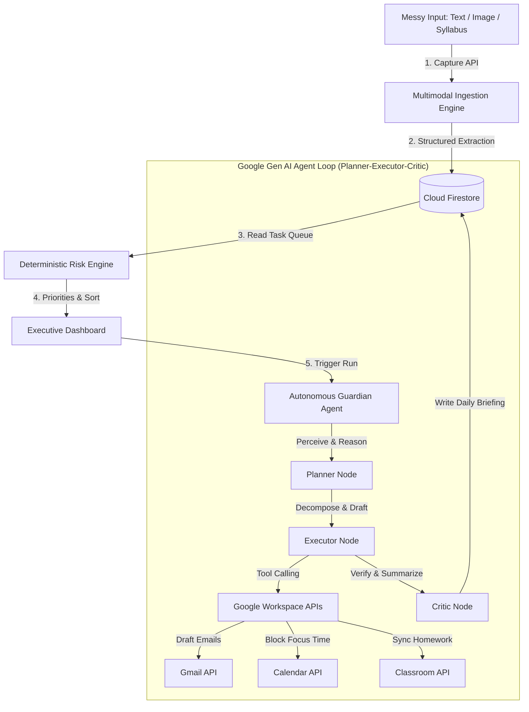

# Clutch — The Autonomous Deadline-Guardian Agent

> **Problem Statement #1:** The Last-Minute Life Saver
> **Live Deployed App:** [clutch-app-588265011925.us-central1.run.app](https://clutch-app-588265011925.us-central1.run.app)
> **GitHub Repository:** [https://github.com/Shevilll/clutch](https://github.com/Shevilll/clutch)
> **Pitch & Demo Video:** [https://youtu.be/your-demo-video](https://youtu.be/your-demo-video) (Link provided in submission)

---

## The Vision
Traditional calendars and to-do lists are **passive**. They wait for you to update them, and then they alert you of your upcoming deadlines—usually when it is already too late to avoid stress or failure. 

**Clutch** flips this paradigm from passive reminders to **autonomous execution**. It is a Google-Cloud-native, stateful agentic system designed for students and developers facing overwhelming commitments. Snapping a photo of a syllabus or pasting a messy, chaotic chat block is all it takes: Clutch digests the chaos, gauges academic risk via a deterministic engine, schedules dedicated focus blocks on your Google Calendar, drafts emails to your professors in Gmail, and guides you through a cinematic, real-time agentic plan of action.

---

## Key Innovations & Architecture



### 1. Multimodal Capture & Structured Ingestion
Upload messy images of physical flyers, course syllabi, or paste unformatted paragraphs of frantic messages. Powered by **Gemini 2.5 Flash**, the system parses deadlines, maps timezone-specific absolute timings, identifies the task category, and decomposes them into a hierarchy of subtasks with realistic minute-by-minute effort estimates.

### 2. The Deterministic & LLM-Assisted Risk Engine
Instead of basic "high/med/low" priority buttons, Clutch evaluates urgency with a real-time mathematical formula.
$$\text{Urgency Ratio} = \frac{\text{Estimated Work Hours Remaining}}{\text{Calendar Hours to Deadline}}$$
The engine integrates **remaining effort (accounting for progress)**, **type-based weights (e.g., Interview vs. Bill)**, and **deadline proximities (closeness penalties)** to yield a precise, real-time **Risk Score (0 - 100)**. This score is recalculated instantly whenever you update progress or check off subtasks, keeping your workspace dynamically sorted so the highest risk tasks remain at the top.

### 3. Stateful Planner-Executor-Critic Loop (The Guardian)
When you click **Run Guardian**, a stateful agentic loop initializes. The agent is built directly on the plain `@google/genai` SDK using advanced function calling:
*   **Planner:** Inspects current state and creates a strategy.
*   **Executor:** Invokes specialized tools to solve tasks. It can decompose complex tasks into milestones, draft high-fidelity study/markdown outlines, allocate calendar blocks, and write email templates.
*   **Critic:** Inspects artifacts, ensures calendar and email drafts do not contain conflicts or logical mismatches, and saves a personalized, reassuring morning summary of accomplishments.

All agent traces, thoughts, and outputs are streamed in real time to Firestore and shown on a beautiful, cinematic **Live Trace Timeline**.

### 4. Direct Google Workspace Integration (With Sandboxed Fallbacks)
We built genuine integrations with Google Workspace so Clutch can act directly on your behalf:
*   **Google Calendar API:** Finds empty blocks, resolves conflicts, and schedules dedicated focus time.
*   **Gmail API:** Drafts professional email templates (e.g., requesting project extensions or recruiter follow-ups) ready to review and send.
*   **Google Classroom API:** Syncs active coursework directly onto your task board.
*   *Judge's Safety Net:* If you don't connect your Google account, the app automatically switches to **Demo/Sandbox mode**, generating realistic mock responses so you can experience the complete OAuth-connected flow seamlessly.

---

## Google Technologies Utilized

Clutch is architected to utilize the full depth of Google Cloud and Developers resources:
1.  **Vertex AI / Gemini 2.5 Flash (`gemini-2.5-flash`):** Powering multimodal ingestion, structured JSON parsing, overcommitment triage, and the Planner-Executor-Critic loop.
2.  **Cloud Run:** Hosting our containerized Node 22 API backend and static React SPA with auto-scaling and SSL.
3.  **Cloud Firestore (Native Mode):** Backing user state, real-time tasks, subtask-level completions, and streaming agent traces.
4.  **Google Workspace APIs (Calendar, Gmail, Classroom):** Real calendar blocking, draft compositions, and coursework ingestion.
5.  **Firebase Authentication (Google Sign-In):** Providing secure student/developer identity mapping.
6.  **Google Cloud Logging & IAM:** Powering granular security, service account auth, and system diagnostics.

---

## Tech Stack & Design Craftsmanship
Clutch is built as an exquisite, single-page application and modern Node API backend, rejecting standard generic web templates:
*   **Frontend:** React 19, Vite, TypeScript, Tailwind CSS v4, Lucide Icons, and Framer Motion. 
*   **Backend:** Node 22, Express, TypeScript, Firebase Admin SDK, Google APIs Client Library, and `@google/genai`.
*   **UI Polish:** High-fidelity Glassmorphic cards, shimmering progress bars, custom SVG brand marks, a dynamic overcommitment dial, and a fully interactive "Under the Hood" Google-technology trace map.

---

## Running Locally

To set up and run Clutch on your local machine, follow these steps:

### Prerequisites
*   Node.js (v18 or higher, v22 recommended)
*   A Google Cloud Project with Billing enabled (for Vertex AI API)
*   Firebase Project (for Firebase Auth and Firestore)

### 1. Configuration (.env setup)

Create a `.env` file inside the `/server` directory:
```env
PORT=8080
GCLOUD_PROJECT=your-gcp-project-id
# Optional if you are running outside of GCP with ADC
GOOGLE_APPLICATION_CREDENTIALS=path/to/service-account.json 
# Optional fallback if ADC is not used
GEMINI_API_KEY=your-gemini-api-key
```

### 2. Install and Run the Server Backend

```bash
cd server
npm install
npm run dev
```
The server will start on [http://localhost:8080](http://localhost:8080) with hot-reloading active.

### 3. Install and Run the Frontend Client

```bash
cd ../web
npm install
npm run dev
```
Open [http://localhost:5173](http://localhost:5173) in your browser to run the application.

---

## Project Structure

```text
clutch/
├── server/
│   ├── src/
│   │   ├── index.ts        # Main Express server and API endpoints
│   │   └── triage.ts       # LLM Overload Triage analysis logic
│   ├── package.json
│   └── tsconfig.json
├── web/
│   ├── src/
│   │   ├── components/     # High-fidelity dashboard widgets and tabs
│   │   │   ├── TodayTab.tsx      # Today focus dashboard & Google Calendar
│   │   │   ├── TasksTab.tsx      # Sorted taskboard & Risk Engine
│   │   │   ├── AgentTab.tsx      # Real-time Agent Trace & Timeline
│   │   │   ├── TechMapTab.tsx    # "Under the Hood" Interactive Architecture Map
│   │   │   ├── TriageModal.tsx   # Calorie-meter dial for Overcommitment Triage
│   │   │   └── LandingPage.tsx   # Premium dark landing page
│   │   ├── App.tsx         # Root routes and state sync
│   │   └── firebase.ts     # Client auth configuration
│   ├── package.json
│   └── vite.config.ts
└── Dockerfile              # Unified production docker build
```

---

*Made with love for the Vibe2Ship Hackathon by Shevilll.*
